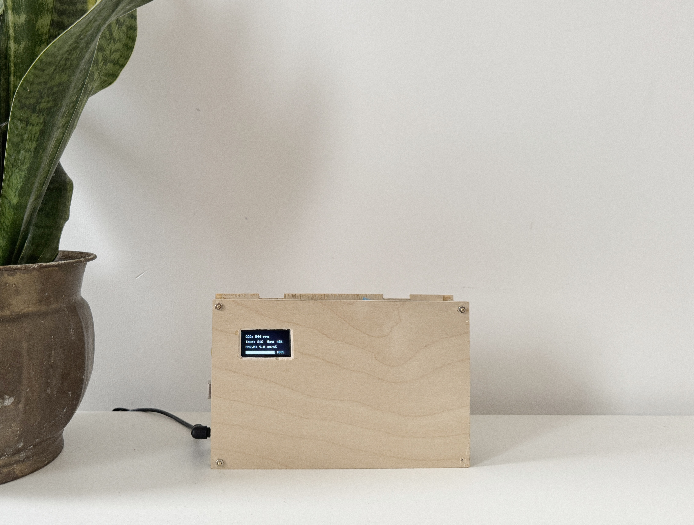
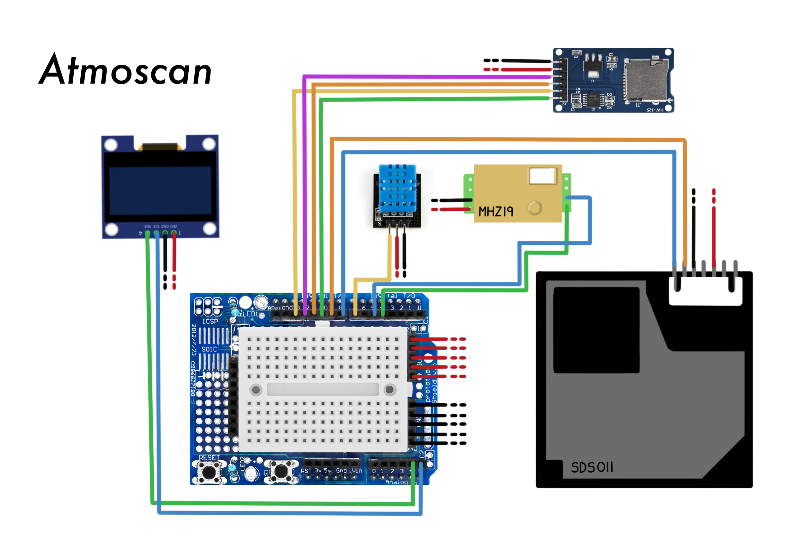
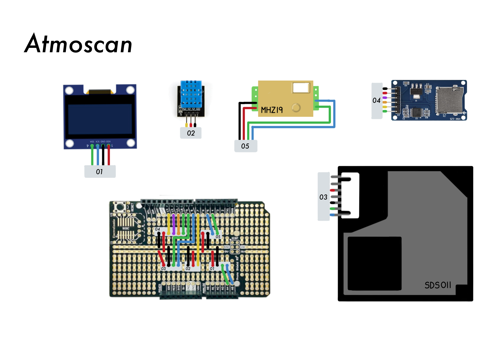

<a id="readme-top"></a>
<div align="center">
  <h1>Atmoscan</h1>
  <p>
    Air Quality Control Monitor.
  </p>

</div>

<br />

<!-- Table of Contents -->
<details open>
  <summary>Table of Contents</summary>

- [About](#about)
- [Features](#dart-features)
- [Components](#components)
- [Wiring](#wiring)
- [Installation](#installation)
- [Usage](#usage)

</details>

<!-- About the Project -->

## About

<div align="center">
  
</div>

Atmoscan is an Arduino-based air quality monitoring system designed to measure and display various environmental
parameters in real-time. The device provides continuous monitoring of air quality indicators and alerts users when air
quality deteriorates to unhealthy levels.

<!-- Features -->

### :dart: Features

- Real-time monitoring of multiple air quality parameters
- OLED display showing current readings
- Visual and auditory alerts for poor air quality
- Historical data logging capabilities

<!-- Components -->

## Components

### :nut_and_bolt: Hardware

- Arduino Uno
- DHT11 Temperature & Humidity Sensor
- MH-Z19 CO2 Sensor
- SDS011 Particule Sensor
- 128*64 Display (I2C)
- Micro SD SPI Reader
- ElectroCookie Proto Shield
- Dupont or JST

<!-- Libraries -->

### :books: Libraries

```cpp
#include <Wire.h>
#include <SoftwareSerial.h>
#include "MHZ19.h"
#include <dht.h>
#include <SPI.h>
#include <SD.h>
#include "SSD1306Ascii.h"
#include "SSD1306AsciiWire.h"
```

<!-- Wiring -->

## Wiring

1. Wiring with Dupont
2. Soldered using JST
<div style="display: flex; gap: 20px;">
  
  
</div>

### :electric_plug: Pin Connections
| Component           | Pin | Name | Description       |
|---------------------|-----|------|-------------------|
| SDS011 (particules) | 2   | TX   | Data transmission |
|                     | 3   | RX   | Data reception    |
| MH-Z19 (CO₂)        | 4   | TX   | Data transmission |
|                     | 5   | RX   | Data reception    |
| DHT11               | 7   | Data | Digital signal containing temperature & humidity data. |
| SPI MicroSD Reader  | 10  | CS   | Chip Select: Activates the SD module for SPI communication. |
|                     | 11  | MOSI | Master Out Slave In: SD card receives data. |
|                     | 12  | MISO | Master In Slave Out: SD card sends data. |
|                     | 13  | SCK  | Serial Clock: Synchronizes SPI communication. |
| Screen              | A3  | SDA  | Serial Data Line: Data line for I2C communication. |
|                     | A4  | SCK  | Serial Clock Line: Clock line for I2C communication. |

<!-- Installation -->

## Installation

1. Clone the repository

```bash
  git clone https://github.com/Big-Bratan/Atmoscan.git
```

2. Install required libraries in Arduino IDE
3. Connect components according to the wiring diagram
4. Upload the code to your Arduino

<!-- Usage -->

## Usage

1. Power up the device
2. The OLED display will show the startup logo followed by current readings
3. Monitor displays:

- CO2 levels (ppm)
- Temperature (°C)
- Humidity (%)
- Particulate Matter (PM2.5)
- Air Quality Index

### :clipboard: Datasheet

**MH-Z19 CO2 Sensor**

| Indice  | CO₂ (ppm)   | Quality                    |
|---------|-------------|----------------------------|
| Normal  | 400 - 1000  | Fresh air                  |
| Average | 1000 - 2000 | Average - Should ventilate |
| Bad     | >2000       | Urgent ventilation         |

**SDS011 Particules Sensor**

| Indice    | PM2.5 (µg/m³) | PM10 (µg/m³) | Quality      |
|-----------|---------------|--------------|--------------|
| Good      | 0-12          | 0-54         | Clean air    |
| Moderate  | 13-35         | 55-154       | Ok           |
| Sensitive | 36-55         | 155-254      | Can irritate sensitive persons |
| Bad       | 56-150        | 255-354      | Higher risks |
| Dangerous | >150          | >354         | Poluted |

**DHT11 Temperature & Humidity Sensor**

| Indice      | Normal Range | Quality          |
|-------------|--------------|------------------|
| Temperature | 20-25°C      | Optimal comfort  |
| Humidity    | 40-60%       | Ideal for health |


## :raised_hands: Acknowledgments
- [@AriSky1](https://github.com/AriSky1) - For the project idea
<!-- Acknowledgments -->
<!--
## :raised_hands: Acknowledgments

Use this section to mention useful resources and libraries that you have used in your projects.

- [MHZ19 Code example](https://esphome.io/components/sensor/mhz19.html)
- [Similar project with more sensors and display features](https://howtomechatronics.com/projects/diy-air-quality-monitor-pm2-5-co2-voc-ozone-temp-hum-arduino-meter/#h-the-co2-sensor-mh-z19)

## License

Distributed under the MIT License. See `LICENSE` for more information.
-->

<p align="right">(<a href="#readme-top">back to top</a>)</p>
